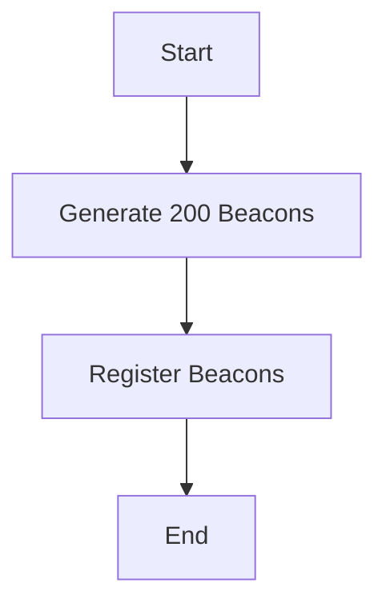
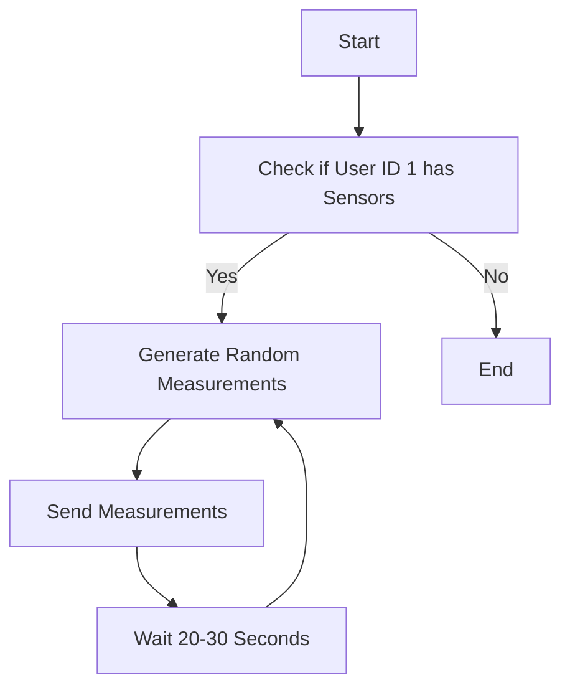

# Beacon Generator Project

## Overview

This project generates and registers beacons, and sends random measurements for selected sensors. It includes the following components:

1. **GenerateBeacon.py**: Generates and registers 200 beacons.
2. **MedicionesSender.py**: Sends random measurements for selected sensors.
3. **index.py**: Main script to check if user ID 1 has sensors and starts sending measurements.
4. **SensorAndMedicion.py**: Defines the Sensor and Medicion models.

## Installation

1. Clone the repository:
    ```sh
    git clone https://github.com/your-repo/beacon-generator.git
    cd beacon-generator
    ```

2. Install the required Python packages:
    ```sh
    pip install -r requirements.txt
    ```

3. Install the required Node.js packages:
    ```sh
    npm install
    ```

## Usage

1. Start the server:
    ```sh
    node index.js
    ```

2. Run the main script:
    ```sh
    python index.py
    ```

## Flow Diagrams

### Beacon Generation and Registration



### Sending Random Measurements



## File Descriptions

### GenerateBeacon.py

Generates and registers 200 beacons.

### MedicionesSender.py

Sends random measurements for selected sensors.

### index.py

Main script to check if user ID 1 has sensors and starts sending measurements.

### SensorAndMedicion.py

Defines the Sensor and Medicion models.

## Example

To generate and register beacons, and send random measurements, follow these steps:

1. Start the server:
    ```sh
    node index.js
    ```

2. Run the main script:
    ```sh
    python index.py
    ```

## License

This project is licensed under the MIT License.